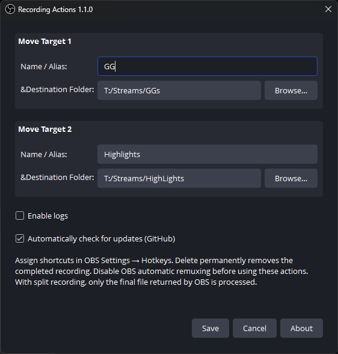
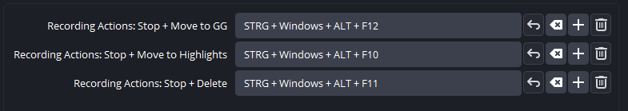

# Recording Actions for OBS Studio

Stop an OBS recording and move it to one of two folders, or delete it, with a hotkey.

**Requires Windows 10/11 x64 and OBS Studio 32.2.2.**

## Install

1. Download the **Windows installer** (`*-windows-x64-setup.exe`) from [the latest release](https://github.com/Diddlik/obs-recording-actions/releases/latest).
2. Close OBS, run the installer, and select your OBS installation folder.
3. Start OBS and open **Tools → Recording Actions**.

## Set up your folders

Enter a name and destination folder for each target, then select **Save**. Leave a folder empty to disable that target.

## Assign hotkeys and use

1. Open **OBS Settings → Hotkeys**.
2. Assign shortcuts to **Stop + Move** for each target and **Stop + Delete**.
3. Start recording normally. Press the desired shortcut to stop and process the recording.

The names follow your saved aliases. The shortcuts shown below are examples; choose your own.

**Delete is permanent. It does not use the Recycle Bin.**

**Disable automatic remuxing** in **OBS Settings → Advanced → Recording**. Otherwise, the plugin ignores its action shortcuts.

With split recordings, only the final recording file is processed.

## Updates

Automatic update checks can be disabled in the plugin settings. You can also check manually under **About → Check for updates**.

When an update is available, download the installer, close OBS, and run it. Your settings and hotkeys are kept.

[Technical documentation: manual installation, troubleshooting, builds, and tests](docs/technical.md) · [License](LICENSE)
